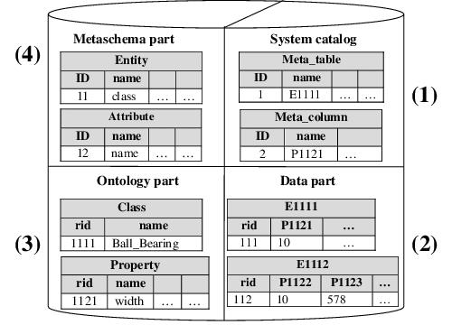

# This repository is for OntoDBSchema 2

You are looking at the repository of OntoDBSchema for OntoDB version 2. The repository of OntoDBSchema for OntoDB version 1 is [OntoDBSchema_v2](https://github.com/lias-laboratory/ontodbschema_v1).

Please refer to [OntoDB repository](https://github.com/lias-laboratory/ontodb) to have a big picture of OntoDB ontology based database tool.

## Overview

The OntoDB architecture has been initially designed for storing PLIB ontologies and their instances. As the PLIB ontology language regularly evolves and because several other ontology languages exist, the first objective of this architecture was to support evolutions of the used ontology language. This architecture was to design an OntoDB is implemented on top of the PostgreSQL DB-MS. It has a four-parts architecture depicted in the next figure.



###  The data part (2)

The data part uses the horizontal storage layout. In this storage layout, a table is associated to each concrete class. Each one of these tables has a column named rid to identify class instances. In addition, this table has one column for each property used by at least one instance of this class. To define the link between an instance and its belonging class, the name of a table (resp. of a column) is the concatenation of "E" (resp. "P") with the identifier of the corresponding class (resp. property).

### The ontology part (3)

It contains all the ontologies that dene the semantics of the various domains covered by the database. OntoDB supports the PLIB ontology model which includes the core ontology model of OntoQL. Thus, this part contains a set of table to store PLIB ontologies.

### The metaschema part (4)

The meta-schema part records the ontology model used. For the ontology part, the meta schema part plays the same role as the one played by the metabase in traditional databases systems. In previous figure (2), two tables based on a UML meta-model are used to store the entity class and its attribute name. OntoQL statements have been implemented according to this architecture.

### The system catalog part (1)

The **system catalog** is a traditional part of any DBMS. It contains system tables used to manage all the data contained in the database. In OntoDB, it contains specically the description of all the tables and columns dened in the three other parts of this architecture.

## Download

The OntoDB schema can be downloaded into the _sql_ directory.

## Software requirements

OntoDBSchema can be deployed to:

* Postgresql
* Oracle
* HSQLDB

## Installation with Postgresql

* Import the ontology based data base template_ontodb

```
$ createdb -U postgres template_ontodb
$ psql -U postgres template_ontodb < template_ontodb_postgresql.sql
```

## Software licence agreement

Details the license agreement of OntoDBSchema V2: [LICENSE](LICENSE)

## Historic Contributors (core developers first followed by alphabetical order)

* [Chimène FANJAM(core developer)](https://www.lias-lab.fr/members/chimenefankam/)
* [Mickael BARON(core developer)](https://www.lias-lab.fr/members/mickaelbaron/)
* [Yamine AIT-AMEUR](https://www.lias-lab.fr/members/yamineaitameur/)
* [Ladjel BELLATRECHE](https://www.lias-lab.fr/members/bellatreche/)
* [Hondjack DEHAINSALA](https://www.lias-lab.fr/members/hondjackdehainsala/)
* [Stéphane JEAN](https://www.lias-lab.fr/members/stephanejean/)
* [Guy PIERRA](https://www.lias-lab.fr/members/guypierra/)
* [Eric SARDET](https://www.lias-lab.fr/members/ericsardet/)
